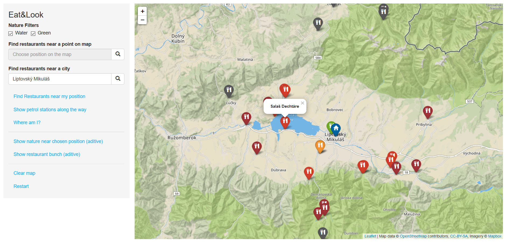
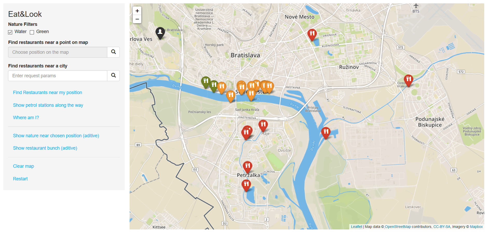
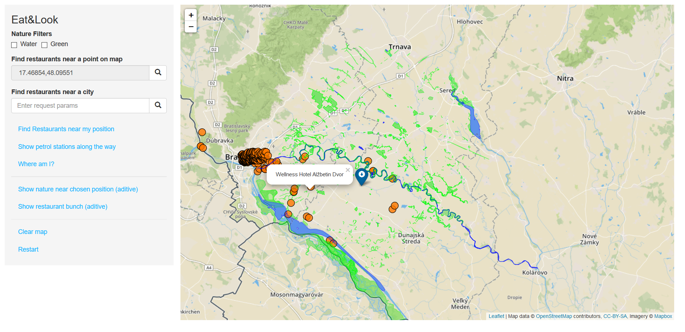
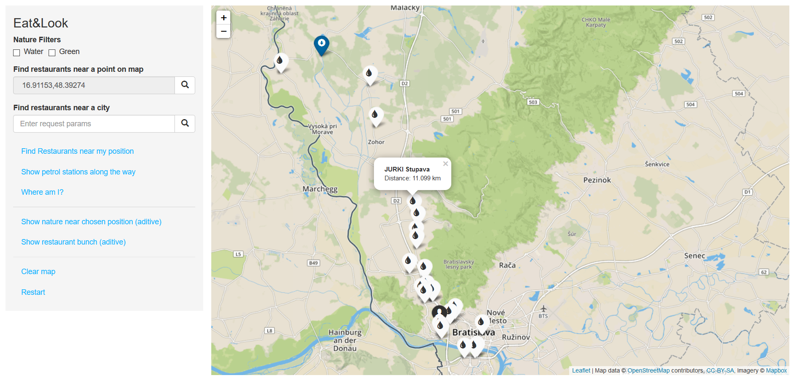
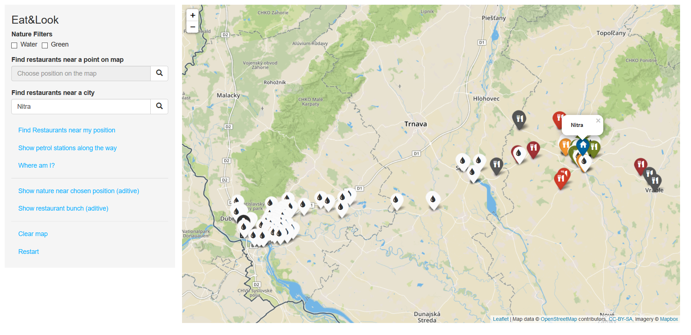

# General course assignment

Build a map-based application, which lets the user see geo-based data on a map and filter/search through it in a meaningfull way. Specify the details and build it in your language of choice. The application should have 3 components:

1. Custom-styled background map, ideally built with [mapbox](http://mapbox.com). Hard-core mode: you can also serve the map tiles yourself using [mapnik](http://mapnik.org/) or similar tool.
2. Local server with [PostGIS](http://postgis.net/) and an API layer that exposes data in a [geojson format](http://geojson.org/).
3. The user-facing application (web, android, ios, your choice..) which calls the API and lets the user see and navigate in the map and shows the geodata. You can (and should) use existing components, such as the Mapbox SDK, or [Leaflet](http://leafletjs.com/).

## Example projects

- Showing nearby landmarks as colored circles, each type of landmark has different circle color and the more interesting the landmark is, the bigger the circle. Landmarks are sorted in a sidebar by distance to the user. It is possible to filter only certain landmark types (e.g., castles).

- Showing bicykle roads on a map. The roads are color-coded based on the road difficulty. The user can see various lists which help her choose an appropriate road, e.g. roads that cross a river, roads that are nearby lakes, roads that pass through multiple countries, etc.

## Data sources

- [Open Street Maps](https://www.openstreetmap.org/)

## My project

Fill in (either in English, or in Slovak):

**Application description**: This web application allows users to see location of restaurants on  the map of Slovakia.  Popup of any restaurant marker shows its name, the color of the marker depends on the distance of the restaurant from a chosen position.  It can also display the name and distance of petrol stations along the bee-line (straight line between two places) of users position and a chosen destination.

There are 3  methods for searching restaurants:
- Based on user's current position
- Based on a chosen point
- Based on city/town name

There is also a possibility to filter restaurants located near natural environments:
- Water \- restaurants in  close proximity of lakes, rivers, etc.
- Green \- restaurants in close proximity of parks, forests, trees, gardens, etc.

There is some additional functionality for fun:
- Randomly showing restaurant (orange dots) on the map. It's an additive function, which mean repeatedly executing it shows more and more restaurants
- Showing natural environments near a position \- displays category 'Green' with green color and 'Water' with blue color, also additive function
- Getting user's location

**Application usage examples**:

Searching restaurants around city `Liptovsky Mikulas` (does not have to be entered exactly). We are displaying only those near `Water` and `Green`. The proper name for a city is also returned into the input field.



Searching for restaurants at user's actual position.



Playing around with additional functions for fun.



Show petrol stations along the way for a chosen position on map.



Searching  all restaurants in `Nitra`  and showing petrol stations along the way to Nitra.



**Data source**: *OpenStreetMaps*, area of Slovakia, *Mapbox* for map tiles

**Technologies used**: NodeJS, Express, Postgis(Postgres), bootstrap,  Jade, Leaflet, Javascript(Ajax, jQuery), REST Api

**Application architecture**:
It is a 3-layered web application:
- Frontend \- map.jade
- Backend \- map.js, db.js, queryBuilder.js
- Database \- Postgres

## Frontend

All the relevant frontend code is located inside *map.jade*. Jade is a templating language, so it is must be compiled into HTML. This file also contains javascript code for managing leaflet plugin and requesting the backend.

When user clicks on a button, *jQuery* catches this action and we handle it by preparing all needed parameters and sending  *HTTP GET* request via *Ajax* to the backend server. Upon receiving the response we just display it in the correct visual format using leaflet's api.

## Backend

Within *map.js* is all the logic for handling requests from clients. The REST api is using *express framework's router* module. There is a *db.js* file for creating the connection to our database and  *queryBuilder.js* for creating all queries. Results from the database are parsed using *postgistogeojson.js*, that transforms them to a geoJSON  *featureCollection*  format.

For getting user's position web browser's *geolocation API* is used. For it to work, user must **enable location** access.

**REST services**:

There are several REST services within map.js and their names are self-explanatory:
- /getRestaurantsByCity
- /getRestaurantsByPoint
- /getPumps
- /getNatureByPoint
- /getAllRestaurants


## Database

I am using `PostgreSQL` with `postgis`  and `unaccent` extensions.

*ST_AsGeoJSON()* function is used for returning geospatial data in geoJSON format.

Both geometry and geography indices are created to improve query speed:

```sql
CREATE INDEX polygon_gix ON planet_osm_polygon USING GIST (way);

CREATE INDEX polygon_gix_geog ON planet_osm_polygon USING GIST (way:geography);

CREATE INDEX point_gix ON planet_osm_ point USING GIST (way);

CREATE INDEX point_gix_geog ON planet_osm_ point USING GIST (way:geography);
```

**Importing data**:
`osm2pgsql` tool's command ``osm2pgsql -l -G -U postgres -H localhost -d pdtdb map.osm`` is used to import geo data from `OpenStreetMaps`.

The imported geo data is in `SRS:4326 (WGS84)` projection.

**Queries**:

Queries using filters(Water,Green) are created dynamically within the code by joining query parts together.

Here are some examples queries (correspond to the above application usage examples):

- Searching restaurants around city `Liptovsky Mikulas` (does not have to be entered exactly). We are displaying only those near `Water` and `Green`. The proper name for the searched city is also returned into the input field.

```sql
SELECT name,ST_AsGeoJSON(way)as geojson
FROM planet_osm_point point
WHERE LOWER(unaccent(point.name)) LIKE LOWER(unaccent('%liptovsky mikulas%'))
    AND point.place IN ('city','town') LIMIT 1;
```
```sql
WITH myPoint AS(
    	SELECT ST_Point(19.6164972, 49.0832482) as way
    ), natureNearPoint AS(
 	SELECT poly.*
    FROM planet_osm_polygon poly, myPoint
    WHERE ST_DWithin(myPoint.way, poly.way,20000,true)
         AND (
                 (poly.leisure IN ('park','nature_reserve','garden')
                  OR poly.boundary = 'national_park'
                  OR poly.natural = 'wood'
                  OR poly.landuse IN ('forest','recreation_ground'))
                  OR
                 (poly.natural='water'
        AND poly.water  NOT IN ('canal','wastewater'))
              )
 	), restaurantNearPoint AS(
     SELECT  DISTINCT ON (point_A.way) point_A.way,
     			point_A.name, ST_DistanceSphere(point_A.way,myPoint.way) as distance
      FROM planet_osm_point point_A, myPoint
      WHERE point_A.amenity = 'restaurant' AND point_A.name IS NOT NULL
      AND ST_DistanceSphere(point_A.way,myPoint.way) < 20000
 	) SELECT DISTINCT ON (res.way) res.way, res.name, ST_AsGeoJSON(res.way) as geojson, res.distance
    FROM restaurantNearPoint res, natureNearPoint nat
    WHERE ST_DWithin(res.way, nat.way, 100, true);
```

- Searching for restaurants at user's actual position.

```sql
 WITH myPoint AS(
    	SELECT ST_Point(17.064314000000003, 48.159024099999996) as way
    ), natureNearPoint AS(
 	SELECT poly.*
    FROM planet_osm_polygon poly, myPoint
    WHERE ST_DWithin(myPoint.way, poly.way,20000,true)
         AND (
                 (false)
                  OR
                 (poly.natural='water'
        AND poly.water  NOT IN ('canal','wastewater'))
              )
 	), restaurantNearPoint AS(
     SELECT  DISTINCT ON (point_A.way) point_A.way,
     			point_A.name, ST_DistanceSphere(point_A.way,myPoint.way) as distance
      FROM planet_osm_point point_A, myPoint
      WHERE point_A.amenity = 'restaurant' AND point_A.name IS NOT NULL
      AND ST_DistanceSphere(point_A.way,myPoint.way) < 20000
 	) SELECT DISTINCT ON (res.way) res.way, res.name, ST_AsGeoJSON(res.way) as geojson, res.distance
    FROM restaurantNearPoint res, natureNearPoint nat
    WHERE ST_DWithin(res.way, nat.way, 100, true);
```

- Show petrol stations along the way for a chosen position on map.

```sql
WITH line AS (
             SELECT ST_MakeLine( ST_Point(17.0643115, 48.1590277),
                                ST_Point(16.90878, 48.36948))::geography as way
         ), pumps AS(
             SELECT  planet_osm_point.name,  planet_osm_point.way,
             round(ST_DistanceSphere(ST_Point(17.0643115, 48.1590277),planet_osm_point.way)) as dist
             FROM planet_osm_point,line
             WHERE  amenity= 'fuel'
             AND name IS NOT NULL
             AND ST_Contains((ST_Buffer(line.way, 5000))::geometry, planet_osm_point.way)
         )SELECT  pumps.name, pumps.dist, ST_AsGeoJson(pumps.way) AS geojson
         FROM line, pumps;
```